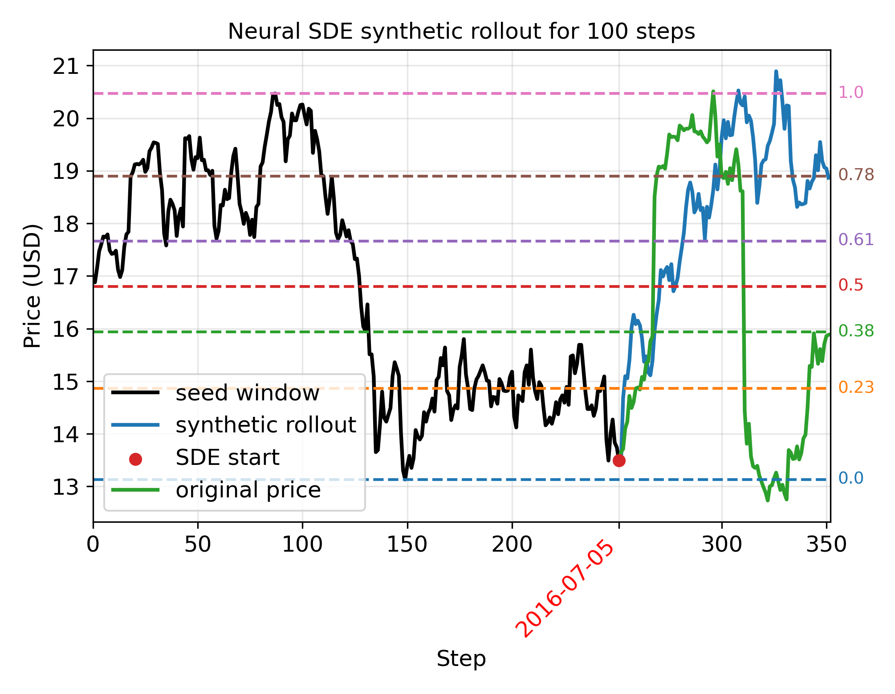
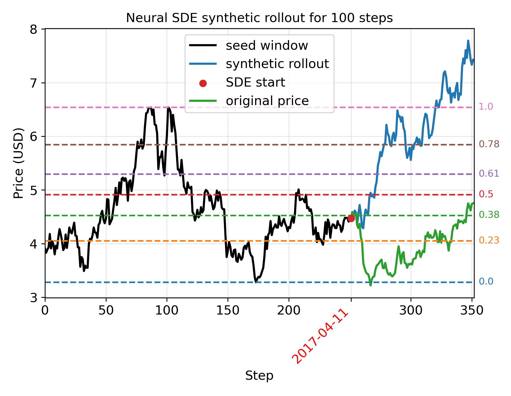

<h1 align="center">
	Synthetic Stock Data via a Mixture of Experts Neural SDE:<br/>
	Modeling Fibonacci Levels
</h1>

This repository contains code and data for experiments on neural SDE synthetic-data generation and asset-management trend prediction, including linear-trend.

## Example Neural SDE Rollouts

These examples show generated 100-step Neural SDE rollouts against the seed window and the corresponding original price path.

<p align="center">
	
	
</p>

## Setup

1. Create and activate a virtual environment.
2. Install the project in editable mode from the repository root:

```bash
pip install -e .
```

3. Populate the `Data/` directory using `data-20250505` folder.

## Repository Layout

- `amgm/`: core package code, data loaders, models, and utilities.
- `experiments/`: runnable experiment scripts and experiment-specific configs.
- `Data/`: input datasets and generated synthetic artifacts.
- `Results`: example visualization results of neural SDE model.
- `workspace/`: training outputs, logs, and checkpoints.

## Neural SDE Workflow

The Neural SDE pipeline lives in `experiments/neural_SDE/` and has four stages:

1. Train a Neural SDE checkpoint.
2. Generate synthetic paths from that checkpoint.
3. Train a classifier using real data plus generated synthetic CSV data.
4. Compare Neural SDE synthetic data against the Vasicek baseline.

### Neural SDE Folder Contents

- [`train_neural_SDE.py`](experiments/neural_SDE/train_neural_SDE.py): trains a Neural SDE model and stores checkpoints.
- [`generate_samples.py`](experiments/neural_SDE/generate_samples.py): loads a checkpoint and saves synthetic datasets using `generate_samples.py` to save CSV dataset and `generate_samples.py --mode mc` to save NPZ dataset.
- [`train_classification.py`](experiments/neural_SDE/train_classification.py): trains the downstream classifier using real data plus the synthetic CSV files in `Data/Synthetic/` generated by `generate_samples.py`.
- [`Statistical_comparison.ipynb`](experiments/neural_SDE/Statistical_comparison.ipynb): compares Neural SDE and Vasicek synthetic data using the NPZ file in `Data/Synthetic/` generated by `generate_samples.py --mode mc`.
- [`trainer_cfg/neural_SDE/`](experiments/neural_SDE/trainer_cfg/neural_SDE): Neural SDE trainer configs.
- [`trainer_cfg/classification/`](experiments/neural_SDE/trainer_cfg/classification): classification trainer configs.

### 1. Train A Neural SDE Checkpoint

Run from the repository root:

```bash
python experiments/neural_SDE/train_neural_SDE.py --trainer_cfg US_Stocks
```

Notes:

- The config is loaded from `experiments/neural_SDE/trainer_cfg/neural_SDE/US_Stocks.py`.
- Checkpoints are written under `workspace/neural_SDE/logs/train_neural_SDE/US_Stocks/checkpoints/`.

### 2. Generate Synthetic Samples

Generate a synthetic CSV for classifier training:

```bash
python experiments/neural_SDE/generate_samples.py \
	--trainer_cfg US_Stocks \
	--checkpoint-name best-06-val_loss=-2.6836_MoE \
	--batch-size 1000
```

Generate Monte Carlo samples in a NPZ file for statistical comparison:

```bash
python experiments/neural_SDE/generate_samples.py \
	--trainer_cfg US_Stocks \
	--checkpoint-name best-06-val_loss=-2.6836_MoE \
	--batch-size 10000 \
	--mode mc
```

Key options:

- `--checkpoint-name`: checkpoint basename; `.ckpt` is appended automatically if omitted.
- `--mode`: `standard` or `mc`.
- `--batch-size`: generation batch size.
- `--n-steps`: number of forecast steps.
- `--mc-paths`: number of rollouts per initial condition in MC mode.
- `--issue-id`, `--test-date`, `--num-iids`, `--seed`: optional filters and reproducibility controls.

Outputs:

- Synthetic CSV files in `Data/Synthetic/`, such as `synthetic_rollout_paths_MoE.csv`.
- Monte Carlo NPZ artifacts in `Data/Synthetic/`, including `synthetic_rollout_MC_valid_samples.npz`.
- Rollout plots and intermediate outputs under `workspace/neural_SDE/`.

### 3. Train The Classifier With Real And Synthetic Data

Run:

```bash
python experiments/neural_SDE/train_classification.py --trainer_cfg US_Stocks
```

Important:

- `neural_SDE_model_type` is currently set inside `experiments/neural_SDE/train_classification.py`.
- `synthetic_share_of_total` is also configured inside that script.
- The selected model type must match the synthetic CSV filename suffix in `Data/Synthetic/`.
- Current supported synthetic file suffixes are `MLP`, `MoE`, and `PatchTST`.

### 4. Statistical Comparison

Use `experiments/neural_SDE/Statistical_comparison.ipynb` to compare Neural SDE synthetic samples against the Vasicek baseline after generating the Monte Carlo NPZ artifact.